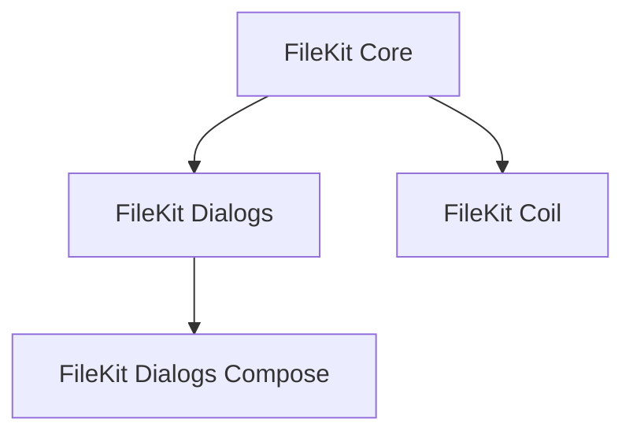

<Frame>
  
</Frame>

FileKit is a lightweight yet powerful library that simplifies file operations across multiple platforms using Kotlin Multiplatform. 

Whether you need to pick files, save documents, access photos, or manage directories, FileKit provides a consistent API that works seamlessly on Android, iOS, macOS, JVM (Windows, macOS, Linux), JS, and WASM.

```kotlin
// Pick an image file
val imageFile = FileKit.openFilePicker(type = FileKitType.Image)

// Pick multiple files
val files = FileKit.openFilePicker(mode = FileKitMode.Multiple())

// Pick a directory
val directory = FileKit.openDirectoryPicker()

// Save a file
PlatformFile(directory, "image.png").write(imageFile)
```

## Why Choose FileKit?

<CardGroup cols={2}>
  <Card
    title="Cross-Platform"
    icon="globe"
  >
    One API for all platforms: Android, iOS, macOS, JVM, JS, and WASM
  </Card>
  <Card
    title="Native experience"
    icon="puzzle-piece"
  >
    Uses platform-native file pickers for the best user experience
  </Card>
  <Card
    title="Lightweight"
    icon="feather"
  >
    Minimal dependencies to keep your app fast and lean
  </Card>
  <Card
    title="Integrations"
    icon="sparkles"
  >
    Seamless integration with Compose Multiplatform, Coroutines, kotlinx-io, Coil...
  </Card>
</CardGroup>

## Key Features

FileKit offers a comprehensive suite of tools for handling files across platforms:

<Frame>
  
</Frame>

### File Operations
- **File & Media Pickers**: Open files, images, videos, or any document type with platform-native pickers
- **Directory Selection**: Access directories easily with native folder pickers
- **File Saving**: Save files to user-selected locations
- **Cross-Platform API**: Write once, run everywhere with consistent behavior

### Integration & Utilities
- **Compose Multiplatform Support**: Seamless integration with Compose UI
- **Coroutines Support**: Asynchronous file operations with Kotlin coroutines
- **Platform File Abstraction**: Work with files consistently across platforms
- **Coil Integration**: Display images from files easily in your Compose UI

## Getting Started

Get up and running with FileKit in minutes with our comprehensive guides:

<CardGroup cols={2}>
  <Card
      title="Quick Start"
      icon="rocket"
      href="/quickstart"
    >
    Get started with FileKit in minutes
  </Card>
  <Card
    title="Installation"
    icon="download"
    href="/installation"
  >
    Add FileKit to your Kotlin Multiplatform
  </Card>
  <Card
    title="Core Concepts"
    icon="book"
    href="/core/platform-file"
  >
    Learn about PlatformFile and essential FileKit concepts
  </Card>
  <Card
    title="Dialogs setup"
    icon="window"
    href="/dialogs/setup"
  >
    Pick files, save files, and more with FileKit Dialogs
  </Card>
</CardGroup>

## Modular Structure

FileKit is designed to be modular, allowing you to include only what you need:



- **FileKit Core**: Basic file operations and the `PlatformFile` abstraction
- **FileKit Dialogs**: File pickers and save dialogs without UI dependencies
- **FileKit Dialogs Compose**: Compose Multiplatform integration for file operations
- **FileKit Coil**: Integration with Coil for image loading

Check out our [sample projects](https://github.com/vinceglb/FileKit/tree/main/samples) to see FileKit in action across different platforms.
