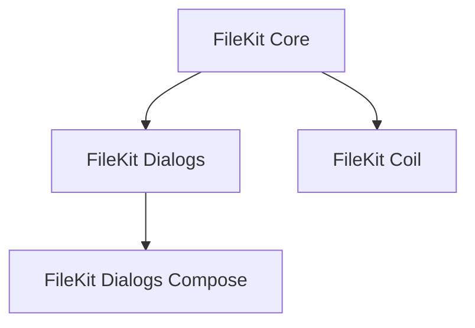

<Frame>
  
</Frame>

FileKit is a lightweight yet powerful library that simplifies file operations across multiple platforms using Kotlin Multiplatform. 

Whether you need to pick files, save documents, access photos, or manage directories, FileKit provides a consistent API that works seamlessly on Android, iOS, macOS, JVM (Windows, macOS, Linux), JS, and WASM.

```kotlin
// Pick an image file
val imageFile = FileKit.openFilePicker(type = FileKitType.Image)

// Pick multiple files
val files = FileKit.openFilePicker(mode = FileKitMode.Multiple())

// Pick a directory
val directory = FileKit.openDirectoryPicker()

// Save a file
PlatformFile(directory, "image.png").write(imageFile)
```

## Why Choose FileKit?

<CardGroup cols={2}>
  <Card
    title="Cross-Platform"
    icon="globe"
  >
    One API for all platforms: Android, iOS, macOS, JVM, JS, and WASM
  </Card>
  <Card
    title="Native experience"
    icon="puzzle-piece"
  >
    Uses platform-native file pickers for the best user experience
  </Card>
  <Card
    title="Lightweight"
    icon="feather"
  >
    Minimal dependencies to keep your app fast and lean
  </Card>
  <Card
    title="Integrations"
    icon="sparkles"
  >
    Seamless integration with Compose Multiplatform, Coroutines, kotlinx-io, Coil...
  </Card>
</CardGroup>

## Who's Using FileKit

FileKit is trusted by developers building amazing cross-platform applications:

- **[Heron](https://github.com/tunjid/heron)** - KMP Bluesky client using FileKit for image preview when uploading images or videos
- **[Rush](https://github.com/shub39/Rush)** - Lyrics search app like Spotify
- **[Composables SVG to Compose](https://composables.com/svg-to-compose)** - Web tool to convert SVG to Compose code in seconds
- **[Twine](https://github.com/msasikanth/twine)** - A multiplatform RSS reader built using Kotlin and Compose
- **[Butler](https://github.com/HLCaptain/butler)** - AI Chat App supporting image uploads across iOS, Android, Desktop, and WasmJS
- **[PixelSafe](https://github.com/StefanOltmann/pixelsafe)** - Free steganography tool for PNG images
- **[AndroidToolKit](https://github.com/LazyIonEs/AndroidToolKit)** - Desktop tools applicable to Android development, supporting Windows, Mac and Linux
- **[Splital](https://splital.com/)** - Easily track and manage your shared expenses, quickly, simply, and hassle-free on [Android](https://play.google.com/store/apps/details?id=com.splital.project) and [iOS](https://apps.apple.com/us/app/splital-settle-up-easily/id6501984581)
- **[Tracker - Manager for Bluesky](https://play.google.com/store/apps/details?id=com.bluesky.followers.analyzer)** - Track and manage your Bluesky followers, unfollowers, blockers, and post analytics — all in real time! On [Android](https://play.google.com/store/apps/details?id=com.bluesky.followers.analyzer) and [iOS](https://apps.apple.com/us/app/tracker-manager-for-bluesky/id6740998282).
- **[Parrot Workout Tracker](https://parrotworkouttracker.com/)** - The ultimate fitness log and exercise tracker to crush your goals on [Android](https://play.google.com/store/apps/details?id=de.kreiniker.parrotworkouttracker) and [iOS](https://apps.apple.com/us/app/workout-tracker-log-parrot/id6741729053).
- **[Ashampoo Photo Organizer](https://www.ashampoo.com/en-us/photo-organizer)** - Photo management software for organizing and searching large photo collections
- **[AB Download Manager](https://github.com/amir1376/ab-download-manager/)** - A Download Manager that speeds up your downloads
- **[Edconv](https://github.com/edneyosf/Edconv)** - A user-friendly interface that simplifies the power of FFmpeg. It's designed for fast and efficient conversion of video and audio files.
- **[Gluky](https://github.com/N7ghtm4r3/Gluky)**, **[Refy](https://github.com/N7ghtm4r3/Refy)**, **[Pandoro](https://github.com/N7ghtm4r3/Pandoro)**, **[Neutron](https://github.com/N7ghtm4r3/Neutron)**, and **[Brownie](https://github.com/N7ghtm4r3/Brownie)** - Self-hosted applications using FileKit for profile pictures and file uploads
- **[Keyguard](https://github.com/AChep/keyguard-app)** - Alternative client for the Bitwarden platform and KeePass (KDBX)
- **[HowMarket](https://github.com/dududaa/howmarket)** - Cross-platform Point of Sale (PoS) software for small and growing businesses, using FileKit to upload and manage product and user images
- **[Authmeister](https://monoroh.com/authmeister)** - Multiplatform OTP authenticator supporting TOTP and HOTP, available on [Android](https://play.google.com/store/apps/details?id=com.kopylovis.authmeister) and [iOS](https://apps.apple.com/us/app/authmeister/id6742833866)
- **[Dancing Decibels](https://www.dancingdecibels.com)** - Multi-platform app for music festivals and live entertainment experiences, using FileKit for image imports and schedule import/export
- **[Kai](https://github.com/SimonSchubert/Kai)** - OpenClaw alternative in your pocket, using FileKit in production across Android, iOS, desktop, and web

## Key Features

FileKit offers a comprehensive suite of tools for handling files across platforms:

<Frame>
  
</Frame>

### File Operations
- **File & Media Pickers**: Open files, images, videos, or any document type with platform-native pickers
- **Directory Selection**: Access directories easily with native folder pickers
- **File Saving**: Save files to user-selected locations
- **Cross-Platform API**: Write once, run everywhere with consistent behavior

### Integration & Utilities
- **Compose Multiplatform Support**: Seamless integration with Compose UI
- **Coroutines Support**: Asynchronous file operations with Kotlin coroutines
- **Platform File Abstraction**: Work with files consistently across platforms
- **Coil Integration**: Display images from files easily in your Compose UI

## Getting Started

Get up and running with FileKit in minutes with our comprehensive guides:

<CardGroup cols={2}>
  <Card
      title="Quick Start"
      icon="rocket"
      href="/quickstart"
    >
    Get started with FileKit in minutes
  </Card>
  <Card
    title="Installation"
    icon="download"
    href="/installation"
  >
    Add FileKit to your Kotlin Multiplatform
  </Card>
  <Card
    title="Core Concepts"
    icon="book"
    href="/core/platform-file"
  >
    Learn about PlatformFile and essential FileKit concepts
  </Card>
  <Card
    title="Dialogs setup"
    icon="window"
    href="/dialogs/setup"
  >
    Pick files, save files, and more with FileKit Dialogs
  </Card>
</CardGroup>

## Modular Structure

FileKit is designed to be modular, allowing you to include only what you need:


```mermaid
graph TD
    A[FileKit Core] --> B[FileKit Dialogs]
    B --> C[FileKit Dialogs Compose]
    A --> E[FileKit Coil]
```

- **FileKit Core**: Basic file operations and the `PlatformFile` abstraction
- **FileKit Dialogs**: File pickers and save dialogs without UI dependencies
- **FileKit Dialogs Compose**: Compose Multiplatform integration for file operations
- **FileKit Coil**: Integration with Coil for image loading

Check out our [sample projects](https://github.com/vinceglb/FileKit/tree/main/samples) to see FileKit in action across different platforms.
